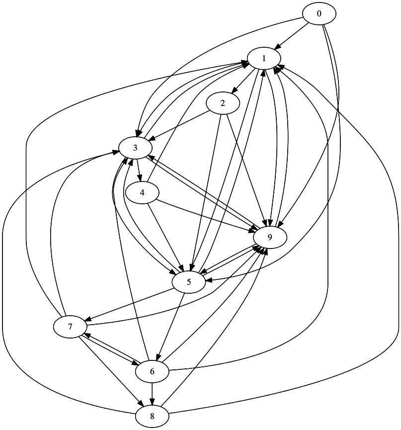

# A well-connected C++11 Boost.Graph tutorial

A well-connected C++11 Boost.Graph tutorial is a C++ tutorial about Boost.Graph.

Downloads:

 * [PDF](boost_graph_tutorial_v1_1.pdf) (v1.1)

This tutorial offers examples to use Boost.Graph that are:

 * Orders concepts chronologically
 * Increases complexity gradually
 * Shows complete pieces of code

Boost.Graph is a C++ library that is part of [www.boost.org](Boost).

## Other resources

  * Siek, Jeremy G., Lie-Quan Lee, and Andrew Lumsdaine. Boost Graph Library: User Guide and Reference Manual, The. Pearson Education, 2001
  * The Boost.Graph website, [http://www.boost.org/doc/libs/1_59_0/libs/graph/doc](http://www.boost.org/doc/libs/1_59_0/libs/graph/doc)

## Older download

 * [PDF](boost_graph_tutorial_v1_0.pdf) (v1.0)
