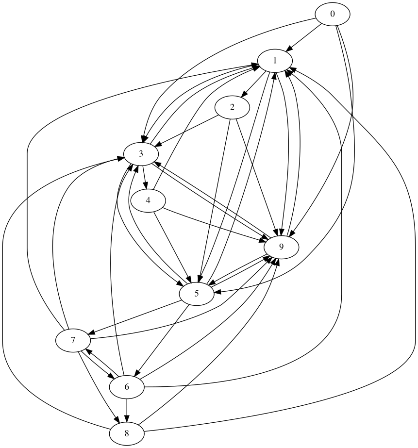

# Boost.Graph Cookbook 1: Basics

Branch   | | |
---------|---------------------------------------------------------------------------------------------------------------------|---------------------------------------------------------------------------------------------------------------------|------------------------------------------------------------------------------------------------------------------------------------------------------------------------------------------------
`master` | | |
`develop`|||

'Boost.Graph Cookbook 1: Basics' is a C++ tutorial about Boost.Graph that is part of a series:

 * [Boost.Graph Cookbook 1: Basics](https://github.com/richelbilderbeek/boost_graph_cookbook_1)
 * [Boost.Graph Cookbook 2: Algorithms](https://github.com/mywtfmp3/boost_graph_cookbook_2)

Downloads:

 * Stable: [PDF](boost_graph_cookbook_1.pdf) (v3.0)
 * Experimental: [PDF](https://github.com/richelbilderbeek/boost_graph_cookbook_1/files/7800940/boost_graph_cookbook_1.pdf) (v3.2.2)
 * Oldskool (also discusses named and custom vertices and edges): [PDF](boost_graph_cookbook_1_oldskool.pdf) (v2.0)

This tutorial offers examples to use Boost.Graph that are:

 * Orders concepts chronologically
 * Increases complexity gradually
 * Shows complete pieces of code

Boost.Graph is a C++ library that is part of [Boost](http://www.boost.org).

## I want to contribute!

See [CONTRIBUTING.md](CONTRIBUTING.md).

## Other resources

  * Siek, Jeremy G., Lie-Quan Lee, and Andrew Lumsdaine. Boost Graph Library: User Guide and Reference Manual, The. Pearson Education, 2001
  * The Boost.Graph website, [http://www.boost.org/doc/libs/release/libs/graph/doc](http://www.boost.org/doc/libs/release/libs/graph/doc)

